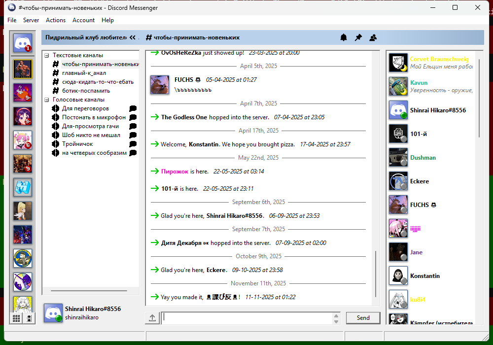

# Discord Messenger - Voice & Streaming Fork

A fork of [Discord Messenger](https://github.com/DiscordMessenger/dm) by iProgramInCpp, adding voice chat, screen sharing (Go Live), and stream viewing capabilities.

**NOTE**: This is beta software. There may be bugs!

## What's New in This Fork

### Voice Chat
- Full voice channel support (join, send & receive audio)
- Voice channel members displayed in channel list
- Audio settings: device selection, volume sliders, voice gate, noise suppression (RNNoise)
- Speech bubble icon on voice channels to open text chat without joining voice

### Screen Share / Go Live
- Share your screen or a specific application window
- DXGI Desktop Duplication capture (Windows 8+)
- H.264 encoding via Media Foundation (hardware-accelerated when available)
- System audio capture (WASAPI loopback) sent alongside video
- Screen/window picker dialog with thumbnails

### Stream Viewer
- Watch other users' Go Live streams
- H.264 decoding with hardware acceleration
- Dedicated viewer window with aspect ratio preservation

## Disclaimer

Using third party clients is against Discord's TOS! Although the risk of getting banned is low, the risk is there! The authors of this software are not responsible for the status of your Discord account.

## Screenshots



## Building

### Prerequisites

1. **Visual Studio 2022** (or Build Tools for Visual Studio 2022)

2. **OpenSSL 3.x** - Download Win64 from https://slproweb.com/products/Win32OpenSSL.html
   - Do NOT download the "Light" versions
   - Set environment variable `OPENSSL_INSTALL64` to the install directory

3. **Submodules** - After cloning:
   ```
   git submodule update --init
   ```

### Build Steps

1. Open `vs/DiscordMessenger.sln` in Visual Studio
2. Select **Release | x64**
3. Build and run

The voice library, libsodium, and Opus are bundled in the `voice/` directory.

## Project Structure

```
src/
  core/
    stream/         # Screen share & stream viewer
      StreamManager     - Go Live lifecycle (PIMPL)
      StreamViewer      - Stream viewer/receiver (PIMPL)
      ScreenCapture     - DXGI + window capture
      H264Encoder       - Media Foundation encoder
      H264Decoder       - Media Foundation decoder
      VideoRTPSender    - H.264 -> encrypted RTP
      VideoRTPReceiver  - Encrypted RTP -> H.264
      LoopbackCapture   - WASAPI system audio -> Opus -> RTP
    voice/          # Voice management
  windows/
    VoicePanel          - Voice UI (connect/disconnect, mute, Go Live)
    ScreenPickerDialog  - Monitor/window selection
    StreamViewerWindow  - Video display window
voice/              # Standalone voice library (from Abaddon)
  include/          # Public headers
  src/              # Voice client, audio engine, UDP
  deps/             # libsodium, opus, rnnoise, miniaudio
deps/               # Other dependencies (asio, json, httplib, etc.)
```

## Attributions

This project is built upon work from:

- [Discord Messenger](https://github.com/DiscordMessenger/dm) by iProgramInCpp (MIT)
- [Abaddon](https://github.com/uowuo/abaddon) by uowuo (GPLv3) - voice subsystem
- [JSON for Modern C++](https://github.com/nlohmann/json) (MIT)
- [Boost](https://www.boost.org) / [Asio](https://think-async.com/Asio) (Boost Software License)
- [cpp-httplib](https://github.com/yhirose/cpp-httplib) (MIT)
- [WebSocket++](https://github.com/zaphoyd/websocketpp) (BSD 3-Clause)
- [libsodium](https://github.com/jedisct1/libsodium) (ISC)
- [Opus](https://opus-codec.org/) (BSD 3-Clause)
- [RNNoise](https://github.com/xiph/rnnoise) (BSD 2-Clause)
- [miniaudio](https://github.com/mackron/miniaudio) (MIT-0 / Public Domain)
- [stb](https://github.com/nothings/stb) (MIT / Public Domain)
- [libwebp](https://github.com/webmproject/libwebp) (BSD)

See [THIRD_PARTY_NOTICES](THIRD_PARTY_NOTICES) for full license details.

## License

This project is licensed under the **GNU General Public License v3.0** - see [LICENSE](LICENSE).

The GPLv3 license is required because the voice subsystem is derived from [Abaddon](https://github.com/uowuo/abaddon), which is GPLv3. All other dependencies use permissive licenses (MIT, BSD, Boost, ISC) that are compatible with GPLv3.
